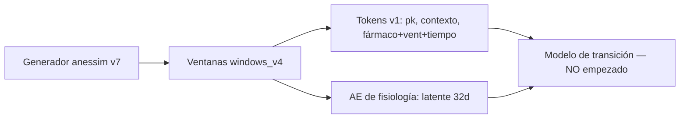

# MEMORIA.md — conocimiento del proyecto `anestesia_world`

Documento de conocimiento y memoria técnica del proyecto. Es la fuente de
verdad junto a los contratos (`contrato_ae_v1.md`, `contrato_tokens_v1.md`),
los manifiestos de procedencia (`manifests/`) y el límite de alcance
(`LIMITACIONES_GENERADOR_v7.md`). El `README.md` describe la estructura y cómo
ejecutar cada pieza; aquí está el porqué y el estado.

---

## 1. Qué es el proyecto

World model de anestesia. El objetivo de largo plazo es un modelo de
transición que prediga la evolución de la fisiología intraoperatoria a partir
de un estado latente. Hoy el proyecto está en **fase de mantenimiento**: el
generador sintético está cerrado (v7), el autoencoder de fisiología está
entrenado y congelado, y la transferencia sintético→real está confirmada. El
modelo de transición **no se ha empezado**.

La cadena prevista es:

## 2. Estado actual (resumen ejecutivo)

| Pieza | Estado | Dónde está |
|-------|--------|------------|
| Generador `anessim` | **cerrado en v7** | `src/anessim/`, `src/anessim/configs/synthetic_v7.yaml`, `scripts/generate_v7.py` |
| Limitaciones del generador | documentadas, no corregidas | `LIMITACIONES_GENERADOR_v7.md` |
| Ventanas | `windows_v4` (cohorte v7 + real) | `data/windows_v4/` |
| Tokens v1 | generados **sobre windows_v2 (PERDIDO)**; pendientes de regenerar sobre windows_v4 | `src/tokens/` |
| AE de fisiología | **entrenado y congelado: variante `ae_bal`** | `data/ae_v1/ae_bal/{encoder.pt,decoder.pt,manifest_ae.json}` |
| Transferencia sintético→real | **confirmada** (sonda v9) | `src/diagnostics/REPORT_v9.txt`, `REPORT_v7_transfer_probe.txt` |
| Modelo de transición | no empezado | — |

Decisiones **cerradas** (no reabrir sin motivo fuerte):

- **AE variante B (`ae_bal`)**, por regularidad del perfil de orden en
  sintético, no por precisión (contrato de AE, iteración 2).
- **No reventanear el real ni reentrenar el AE**: los gates 2/3 del `ae_bal`
  congelado sobre `windows_v4` real val reproducen el manifiesto exacto
  (HR 0.3940, MBP 0.2414, BIS 0.1765, ETCO2 0.0912; gate3 0.3843 / 0.7161).
  Veredicto de integridad cerrado en v10.
- **Cohorte real `windows_v4` ≡ `windows_v2`** (celdas reales idénticas,
  6388 casos, 6091 sujetos, mismas exclusiones): no hay que regenerar la
  cohorte real.

## 3. Cohortes

**Existentes en disco** (`data/`):

| Cohorte | Casos | Ventanas en `windows_v4` (train / val) |
|---------|-------|-----------------------------------------|
| `real` | 6388 casos VitalDB + INSPIRE | 12 061 757 / 2 063 800 |
| `synthetic_v7` | 10 000 base (offset 150001) | 21 728 215 / 3 896 864 |
| `vaso_reinf_v7` | 500 refuerzo vasoactivo (offset 160001) | 1 151 944 / 184 662 |
| `cf_v7` | 6345 pares contrafactuales (pharma 870, vent 600, learning 4875) | 27 863 930 / 4 845 942 |

**Perdidas** (no están en disco; recuperables solo si hay backup externo):

- `windows_v2` — ventanas de la cohorte v5 (rejilla 5 s). **El tokenizador y
  el AE se entrenaron contra ella.** Equivalente a la parte real de
  `windows_v4`, pero las cohortes sintéticas v5 se perdieron.
- `windows_v3` — ventanas de la cohorte v6.
- `synthetic_v5`, `vaso_reinf_v5`, `cf_v5` — cohortes v5 del generador.
- `synthetic_v6`, `vaso_reinf_v6`, `cf_v6` — cohortes v6.

## 4. Cadena de procedencia (`manifests/`)

`data/` está fuera de git (`.gitignore`). Para no perder la trazabilidad, los
manifiestos y los resultados de gates/sondas que viven bajo `data/` se copian
en `manifests/`, que **sí** está versionado. Son ficheros de texto que
registran sha256, recuentos y veredictos; permitieron recuperar el proyecto
cuando se perdió `windows_v2`.

Claves de procedencia más importantes:

- `manifests/windows_v4_manifest.json` — sha del `window.py`, recuentos por
  fuente/split, exclusiones.
- `manifests/windows_v4_split.parquet` — split heredado (70/15/15 por hash de
  subject_id); es la única excepción binaria (pesa <5 MB).
- `manifests/tokens_v1_manifest.json` — stats de normalización y recuentos del
  tokenizador (sobre `windows_v2`).
- `manifests/ae_bal_manifest.json` / `ae_real_manifest.json` — gates, pesos,
  scheduler y `acceptance` del AE.
- `manifests/v9_manifest_global.json` — sha256 de todo `data/` en v9.
- `manifests/inventario_pre_limpieza.txt` — inventario sha256 del repo antes
  de la limpieza (red de seguridad; recuperar con
  `git checkout 88aa324 -- <ruta>`).

## 5. Hechos verificados importantes

### Entorno

- venv: `.venv\Scripts\python.exe`. Los scripts sueltos usan
  `PYTHONPATH=src` (los módulos se importan como `python -m <pkg>.<mod>`).
- GPU: RTX 5080 Laptop 16 GiB. Presupuesto acordado: **máx 6 GiB VRAM**.

### Windows / pyarrow / torch

- **Importar `torch` ANTES que `pyarrow`/`pandas` rompe `pq.read_table`**
  ("Windows fatal exception: access violation", conflicto de DLL). Orden
  seguro: `numpy → pandas → pyarrow → torch`. En scripts sueltos, importar
  `ae.physio_ae` (o pyarrow) antes que `torch`.
- **Escribir `source`/`split` como string bajo directorios hive**
  `source=*/split=*` rompe `pq.read_table` ("string vs dictionary"). Usar
  `pa.dictionary(pa.int32(), pa.string())` (o `ParquetFile.read()`).

### Datos

- Rejilla de 5 s; imagen de 14 variables (BIS/BIS, BIS/EMG, Solar8000/HR,
  PLETH_SPO2, Primus/ETCO2, PEEP_MBAR, PIP_MBAR, MV, TV, RR_CO2,
  Solar8000/BT, ART_MBP, ART_SBP, ART_DBP).
- Targets del generador = `["bis","map","hr","spo2","etco2"]`.
- Exclusiones del tokenizador y del AE: **36 caseids** = 35 reales sin marcas
  de fase + 1 (`4476`) sin celdas. No "4511": ese número fue prosa errónea.

### Tokens

- `pk_tokens.py` — PK poblacional (propofol Schnider, remi Minto, etc.).
- `context_vocab.py` — contexto estático (v1 = 12 items demografía+riesgo;
  gate 6 v1 PASA 0.5662).
- `tokenize.py` — tokenizador fármaco+vent+ctx+tiempo (ventana de 12 celdas,
  stride 60 s train; 21 palancas CF → 7 grupos).

### AE

- Entrada 28 canales (14 valores + 14 máscaras) → latente 32d → 14 valores.
- Nested dropout k~Uniforme{1..32}; pérdida MSE por variable sobre máscara=1.
- Variante elegida `ae_bal` (50/50 real/sintético). `acceptance` con tolerancia
  de regresión 0.05 lpm/mmHg (decidida post hoc, iter 3).

### Transferencia (sonda v9)

- D3 (entrenado en sintético, rollout) **bate D2'** (init aleatoria) en 14/15
  comparaciones → transferencia confirmada. El control 1.5 de v8 era
  defectuoso; el gate v9 es D3 vs D2. Persistencia sigue siendo óptima a 5 s
  (deltas reales son ruido).

## 6. Gotchas operativos

- **PowerShell 5.1 `Out-File -Encoding utf8` añade BOM** → leer con `utf-8-sig`.
- `multi_replace_string_in_file` puede fallar silenciosamente en algunas
  entradas → verificar con grep tras cada lote de ediciones.
- `np.errstate(all="ignore")` no suprime "Mean of empty slice" de `np.nanmean`
  (es un warning de `warnings.warn`); usar media por columna manual.
- Los informes `REPORT_*.txt` se escriben en `reports/` (no en `src/`), tras
  la limpieza de septiembre de 2026.

## 7. Pendiente (siguiente iteración)

1. **Regenerar `tokens_v1` sobre `windows_v4`** (hoy están sobre `windows_v2`,
   perdido). La cohorte real es equivalente, pero las cohortes sintéticas v5
   ya no existen; hay que tokenizar las v7.
2. Modelo de transición (contrato de AE fija el latente como lengua franca;
   el contrato de tokens fija los tokens de entrada).
3. Cerrar las brechas del generador documentadas en
   `LIMITACIONES_GENERADOR_v7.md` **solo si** el modelo de transición rinde
   por debajo de lo esperado.
