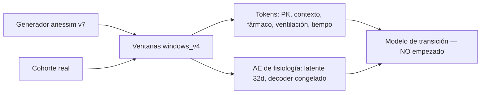

# MEMORIA.md — `anestesia_world`

Documento de conocimiento del proyecto. Consolida lo aprendido en todas las
iteraciones (ventanas, tokens, autoencoder, generador sintético, sonda de
transferencia, integridad de datos) y **sustituye a los informes de iteración
como referencia de trabajo**. Aquí está el porqué y el estado; el `README.md`
describe la estructura y cómo ejecutar cada pieza.

Fuentes que acompañan a este documento:

- `manifests/` — procedencia versionada: sha256, recuentos y resultados de
  gates (§13). **Es la evidencia primaria.**
- `reports/` — informes de iteración y salidas literales de pytest.
- `LIMITACIONES_GENERADOR_v7.md` — brechas conocidas del generador.
- `contrato_ae_v1.md` y `contrato_tokens_v1.md` — **parcialmente desfasados**:
  el de AE conserva el gate 3 antiguo (diferencia mediana < 1 lpm) y el gate 6
  solo por caso; el de tokens referencia cohortes v5. Donde discrepen de este
  documento, manda este documento.

Última actualización: 2026-09-30. Estado: generador cerrado en v7, autoencoder
congelado, modelo de transición no empezado.

> Convención: todo número de este documento proviene de un informe o manifiesto
> del proyecto. Cuando un valor no es reproducible o su fuente se perdió, se
> dice explícitamente.

---

## 1. Qué es el proyecto y qué decidimos que fuera

`anestesia_world` es un **world model de anestesia**: un simulador aprendido
que, dado un estado fisiológico y una acción (fármaco, cambio ventilatorio),
predice cómo evoluciona el paciente. El objetivo último es **contrafactual**:
responder "¿qué habría pasado si hubiera dado X en lugar de Y?", no solo
predecir la siguiente observación.

### Decisiones de alcance

| Decisión          | Contenido                                                                                                                                 | Razón                                                                                                             |
| ----------------- | ----------------------------------------------------------------------------------------------------------------------------------------- | ----------------------------------------------------------------------------------------------------------------- |
| **Fase**          | v1 cubre **solo mantenimiento**. No inducción, no educción.                                                                               | Es la fase de estabilidad, donde la pregunta contrafactual tiene sentido clínico y donde la dinámica es tratable. |
| **Rejilla**       | Celdas de **5 s**; ventana fija de **12 celdas = 1 minuto**. Stride de 60 s en entrenamiento y de 5 s en el conjunto denso de validación. | Cadencia del monitor real; ventana suficiente para capturar el efecto de un bolo sin diluirlo.                    |
| **Contexto**      | Los antecedentes **no cambian**: los cambios van dirigidos a la monitorización.                                                           | El EPOC de un paciente no es una variable de estado; modula cómo le afectan los cambios de medicación.            |
| **`department`**  | Colapsado en `optype`.                                                                                                                    | Redundante y fuga de cohorte.                                                                                     |
| **`asa`**         | Se mantiene.                                                                                                                              | Decisión clínica explícita.                                                                                       |
| **`emop`**        | Se mantiene, con el embedding inicializado desde `emop:0`.                                                                                | Token frágil pero informativo.                                                                                    |
| **Efedrina**      | Se mantiene aunque sea un token frágil.                                                                                                   | Decisión clínica explícita.                                                                                       |
| **Entrenamiento** | **Escalonado**: preentrenar en sintético, ajustar en real.                                                                                | Consecuencia forzada del hallazgo de fuga de cohorte (§5).                                                        |

### Arquitectura, y lo que descartamos por el camino

**Diseño actual:**

```
imagen fisiológica (14 variables + 14 máscaras)
        │
        ▼
  encoder AE ──► latente ordenado de 32d (nested dropout)
        │                    │
        │                    ▼
        │        modelo de transición tokenizado
        │        z_{t+1} = z_t + f(z_t, a_t; c)
        │        atención sobre tokens heterogéneos
        │                    │
        ▼                    ▼
  decoder AE (CONGELADO) ◄───┘
        │
        ▼
  unidades físicas (para todos los gates clínicos)
```

**Descartado — y por qué, para no repetirlo:**

- **Autoencoder expansivo apilado (AE2).** La idea original era un segundo
  autoencoder expansivo a 128d del que se reutilizarían 36 dimensiones fijas en
  el decoder inicial. No crea un idioma latente común: cada nivel aprende su
  propia base y no hay presión para que las dimensiones reutilizadas signifiquen
  lo mismo en los dos espacios.
- **Rotación secuencial de dimensiones** (variar qué dimensiones se usan para
  reconstruir antecedentes, luego fármacos, luego snapshot). Provoca olvido
  catastrófico: lo aprendido con un subconjunto se destruye al pasar al
  siguiente. **Sustituido por nested dropout por muestra** (Rippel et al.), que
  impone el mismo orden sin secuenciar el entrenamiento.
- **Condicionamiento FiLM** para el contexto. Con demasiadas cosas variando a
  la vez, una modulación afín no puede expresar que el contexto afecta de forma
  distinta a los fármacos que a la ventilación. **Sustituido por auto-atención
  sobre tokens heterogéneos** (estado, fármaco, ventilación, contexto, tiempo):
  el modelo aprende qué cambios son relevantes y cuáles aplastan a otros.
- **LeJEPA / objetivo tipo JEPA.** Evaluado y descartado por dos razones
  estructurales: (a) el proyecto **necesita el decoder** —los gates clínicos y
  la interpretación fisiológica dependen de volver a unidades reales— y un JEPA
  no lo da; (b) SIGReg empuja hacia un embedding **isótropo**, que es
  directamente antagónico al **orden** que impone el nested dropout y del que
  sale el dimensionamiento del modelo de transición. Además, con el encoder
  congelado no hay riesgo de colapso, que es el problema que LeJEPA resuelve.
  Sigue siendo una vía interesante para un modelo fundacional entrenado sobre
  ondas de alta densidad, que es otro proyecto.

---

## 2. El pipeline, script a script

Cada script se cerró con su propio ciclo rojo→verde y sus gates. El orden es
de dependencia.



| Script                                 | Produce                                                         | Estado                                                                   |
| -------------------------------------- | --------------------------------------------------------------- | ------------------------------------------------------------------------ |
| `src/autoencoder/window.py`            | `windows_v2` (rejilla de 5 s, máscaras de plausibilidad, fases) | cerrado · **`windows_v2` PERDIDO**                                       |
| `scripts/build_windows_v4.py`          | `windows_v4` (real + cohortes v7)                               | vigente                                                                  |
| `src/tokens/pk_tokens.py`              | `pk_v1` (Ce por fármaco en rejilla)                             | cerrado en la iteración 3                                                |
| `src/tokens/context_vocab.py`          | `context_v1` (vocabulario de contexto)                          | cerrado en la iteración 2                                                |
| `src/tokens/tokenize.py`               | `tokens_v1` (14 550 993 ventanas)                               | cerrado en la iteración 4 · **apunta a `windows_v2`; hay que regenerar** |
| `src/ae/physio_ae.py`                  | `ae_v1/{ae_real,ae_bal}`                                        | cerrado en la iteración 4 · **decoder `ae_bal` congelado**               |
| `src/diagnostics/cohort_gap.py`        | caracterización de la brecha real/sintético                     | cerrado                                                                  |
| `src/diagnostics/gap_addendum.py`      | suelo lineal, cuantización, sonda no lineal, recortes           | cerrado                                                                  |
| `src/diagnostics/v7_attribution.py`    | atribución de la sonda no lineal                                | cerrado                                                                  |
| `src/diagnostics/v7_transfer_probe.py` | **sonda de transferencia (la medida que decide)**               | cerrado                                                                  |
| `src/diagnostics/v6_validate.py`       | gates V1–V7 del generador                                       | **reconstruido desde bytecode**, validado numéricamente                  |

Pesos del AE congelado: `data/ae_v1/ae_bal/{encoder.pt, decoder.pt,
manifest_ae.json, norm_stats.json}`.

### Tokens

- **Fármacos** (7): propofol, remifentanilo, sevoflurano, fenilefrina,
  noradrenalina, efedrina, rocuronio. Features por fármaco: `ce_t0`, `ce_t1`,
  `ce_max`, `bolo`, `dose_cum`, `bolo_obs`. `log1p` antes del z-score en las
  cinco primeras, que son asimétricas.
- **Ventilación** (5 setpoints): FiO2, TV, RR, PIP, PEEP.
- **Contexto**: 12 `item_id` de v1 (§5).
- **Palancas contrafactuales**: 21 palancas agrupadas en 7 `lever_group`
  (propofol, remifentanilo, efedrina, fenilefrina, noradrenalina, sevoflurano,
  ventilación). El rocuronio no tiene palanca.
- **Metadatos obligatorios por ventana**: `source`, `split`, y en los pares CF
  `post_split = t1 > split_t`.

**`tokenize.py` no es reejecutable tal cual sobre v7:** tiene `WINDOWS_V2`
cableado (7 apariciones) y el diccionario `SOURCES` apunta a `synthetic_v5`,
`vaso_reinf_v5` y `cf_v5`. Regenerar los tokens exige parametrizar rutas y
cohortes antes de reejecutar (§11).

---

## 3. Cohorte real — números de referencia

Estos son los valores que permitieron recuperar el proyecto cuando se perdió
`windows_v2`. **Son la huella de identidad del dataset real.**

```
celdas reales (todas las fases)   train 12 061 757 / val 2 063 800 = 14 125 557
celdas reales de mantenimiento    10 432 207  (antes de exclusiones)
casos reales                      6 388  (caseids contiguos 1..6388; VitalDB + INSPIRE)
sujetos reales                    6 091  (train 5 177 / val 914; 236 con >1 caso)
exclusiones                       36 caseids = 35 sin marcas de fase + el caseid 4476
```

**Split:** por paciente (`subjectid`), **85 / 15 train / val**, estratificado
por fuente, con permutación aleatoria de semilla fija (`make_split` en
`window.py`, `VAL_FRAC = 0.15`). No hay split de test. Un sujeto con varios
casos cae entero en el mismo split, lo que evita fuga entre casos del mismo
paciente.

**Imagen de 14 variables**, en el orden canónico de `image_tracks` del
manifiesto de ventanas: BIS/BIS, Solar8000/HR, PLETH_SPO2, Primus/ETCO2,
PEEP_MBAR, PIP_MBAR, MV, TV, RR_CO2, Solar8000/BT, ART_MBP, ART_SBP, ART_DBP,
**BIS/EMG en la posición 14**. El contrato de AE lista EMG en segunda posición;
no tiene efecto semántico (estadísticos y pérdida van por variable), pero todo
indexado por columna usa el orden canónico.

### Cohortes en disco (`windows_v4`)

| Cohorte         | Casos                                                                         | Ventanas train / val   |
| --------------- | ----------------------------------------------------------------------------- | ---------------------- |
| `real`          | 6 388                                                                         | 12 061 757 / 2 063 800 |
| `synthetic_v7`  | 10 000 (caseids desde 150001)                                                 | 21 728 215 / 3 896 864 |
| `vaso_reinf_v7` | 500 refuerzo vasoactivo (desde 160001)                                        | 1 151 944 / 184 662    |
| `cf_v7`         | 12 690 = 6 345 pares (farmacológicos 870, ventilación 600, aprendizaje 4 875) | 27 863 930 / 4 845 942 |

**Ojo con las exclusiones:** durante semanas se describieron como "35 + 4476
sin celdas", legible como 4476 casos. Son **36 caseids**: el campo
`sin_celdas_caseids` del manifiesto es `[4476]`, longitud 1. El código siempre
expandió la lista correctamente, así que **el error fue de prosa, nunca de
cálculo**. Ningún diagnóstico tiene el denominador mal.

Fracción de máscara de plausibilidad `m=1` (mantenimiento real):

```
BIS 0.9247   HR 0.9878   SPO2 0.9920   ETCO2 0.9875   PEEP 0.9695   PIP 0.9717
MV 0.9755    TV 0.9724   RR 0.9891     BT 0.9311      ART_MBP 0.9874
ART_SBP 0.9790  ART_DBP 0.9788  EMG 0.9052
```

Marginales de la cohorte real (split val, con exclusiones, `m=1`, unidades
físicas). **Esta es la tabla contra la que se calibra el generador:**

| Variable      | media  | std   | p1    | p50   | p99   | min  | max   |
| ------------- | ------ | ----- | ----- | ----- | ----- | ---- | ----- |
| BIS/BIS       | 40.91  | 11.54 | 0.00  | 40.70 | 71.70 | 0.00 | 97.70 |
| Solar8000/HR  | 73.53  | 15.62 | 46    | 72    | 118   | 10   | 240   |
| PLETH_SPO2    | 99.51  | 1.26  | 95    | 100   | 100   | 47   | 100   |
| Primus/ETCO2  | 34.80  | 3.77  | 24    | 35    | 45    | 10   | 74    |
| Primus/PEEP   | 2.66   | 2.54  | 0     | 4     | 7     | 0    | 25    |
| Primus/PIP    | 17.56  | 5.24  | 8     | 17    | 32    | 5    | 57    |
| Primus/MV     | 5.70   | 1.42  | 2.80  | 5.60  | 9.50  | 0    | 18.70 |
| Primus/TV     | 397.19 | 88.54 | 168   | 394   | 619   | 50   | 1499  |
| Primus/RR_CO2 | 14.44  | 2.77  | 9     | 14    | 22    | 2    | 60    |
| Solar8000/BT  | 35.78  | 0.98  | 32.10 | 35.90 | 37.10 | 25   | 45    |
| ART_MBP       | 83.51  | 18.50 | 52    | 82    | 130   | 0    | 300   |
| ART_SBP       | 116.27 | 20.61 | 72    | 115   | 170   | 0    | 345   |
| ART_DBP       | 64.15  | 13.74 | 38    | 63    | 97    | 0    | 300   |
| BIS/EMG       | 27.35  | 3.69  | 24.03 | 26.54 | 46.24 | 0    | 84.10 |

**Anomalía conocida y sin resolver:** BIS p1 = 0.00 y las tres ART p1 = 0.00
**en celdas con máscara 1**. Un BIS de 0 en mantenimiento es sensor
desconectado, no fisiología: la máscara de plausibilidad no lo caza. Es ~1 % de
celdas, suficiente para que un clasificador no lineal lo explote. Corrección
pendiente en `window.py`; **no se resuelve emitiendo artefactos falsos en el
generador**.

---

## 4. Farmacocinética (`pk_tokens`)

Modelos: **Schnider** (propofol, elegido; también implementados Marsh y
Eleveld), **Minto** (remifentanilo), **Wierda** (rocuronio). Solo propofol y
remifentanilo tienen PK compartimental con Ce.

**Gate 3 — equivalencia de integrador.** El gate original (error absoluto de Ce
contra el generador) era **inalcanzable**, y entender por qué costó tres
iteraciones:

1. El forward-fill estaba **limitado a 30 s**, convirtiendo huecos de registro
   en paradas de bomba inexistentes.
2. El generador **cambia la tasa cada 180 s**, así que "tasa constante 10 min"
   es una condición insatisfacible por construcción.
3. La **variabilidad interindividual no registrada** (σ 0.20 propofol / 0.15
   remi / 0.15 roc) impone un **suelo de ruido del 20–25 %** que ningún
   integrador puede cruzar.

**Reformulado** como equivalencia entre el integrador del módulo (forma
cerrada) y el de `anessim` (RK4) sin IIV, con la misma serie de tasas y bolos:

```
propofol        0.085 %      remifentanilo  0.090 %     (umbral < 1 %)
sobre v7:       0.086 %                     0.081 %
```

El bug que impedía llegar: `Infusion.rate_at` contaba dos veces el borde del
intervalo cerrado.

**Bolos por volumen: eliminados.** La inferencia de bolos desde `ROC_VOL`
producía basura — saltos de 47 mL que son cambios de jeringa, saltos de 1 mL
que son artefactos de transición de tasa. Los bolos reales de bomba aparecen
como **picos de RATE** (hasta 1200 mL/h) y la integración los captura sin
necesidad de inferirlos.

---

## 5. El hallazgo que reorganizó el proyecto: la fuga de cohorte

Una sonda de origen (regresión logística, `GroupKFold` por caseid) distingue
real de sintético con una facilidad que invalidó el plan original de entrenar
sobre las cohortes mezcladas.

```
fisiología con valores            0.99
solo máscaras                     0.59
sin las 3 variables principales   0.96
```

**La fuga es del dataset, no del contexto.** No se arregla quitando variables.
Consecuencias directas:

- Se descartó el entrenamiento con cohortes mezcladas y muestreo ponderado.
- Se adoptó la **estrategia escalonada** (preentrenar sintético con pares
  contrafactuales, ajustar en real con réplica CF de bajo peso).
- `source` y `split` pasaron a ser **metadatos obligatorios por ventana**.

El contexto se redujo por la misma razón. El vocabulario completo tiene **86
ítems** (12 de alcance v1 + 74 de alcance v2); los 74 de v2 se conservan con sus
estadísticos pero **no se emiten**. La v1 emite **12 `item_id`** que salen de
siete variables: `age`, `sex`, `height`, `weight`, `bmi`, `asa` y `emop`. Con
esa reducción, la sonda de origen sobre el contexto (balanced accuracy) bajó de
**0.9956** en la iteración 1 a **0.5662**, bajo el umbral de 0.60.

---

## 6. Autoencoder (`ae_bal`, congelado)

### Configuración final

```
entrada      28 canales = 14 valores z-scoreados + 14 máscaras (m=0 -> valor 0)
encoder      28 -> 256 -> 256 -> 32      GELU, LayerNorm solo en las ocultas
decoder      32 -> 256 -> 256 -> 14      (nunca LayerNorm sobre el latente)
pérdida      MSE solo en celdas m=1, promediada por variable y luego entre 14
dropout      nested, k ~ Uniforme{1..32} por muestra; inferencia con las 32
optimizador  AdamW lr 1e-3, weight decay 1e-4, batch 4096
planificador warm-up lineal 5 épocas + ReduceLROnPlateau(0.5, paciencia 4,
             umbral 1e-4, min_lr 1e-6); paciencia de parada 12
validación    subconjunto FIJO: 65 536 real + 65 536 sintético, semilla 1234
```

**Variantes:** `ae_real` (solo real) y `ae_bal` (50 % real / 50 % sintético).
**Se congela `ae_bal`.**

```
ae_bal   144 épocas, mejor 139, paró por min_lr, 10 reducciones de LR, val 0.001001
ae_real  110 épocas, mejor  98, paró por paciencia, 8 reducciones,      val 0.005704
```

### Gates de `ae_bal`

**Gate 1 — perfil de orden** (error global por k truncado):

```
val real       k8 = 0.051659   k32 = 0.001457   monótono
val sintético  k8 = 0.043324   k32 = 0.000745   monótono
```

**Gate 2 — reconstrucción en unidades físicas, cohorte real** (mediana por
caso). **Estos son los valores de referencia del decoder congelado:**

```
BIS 0.176   HR 0.394   SPO2 0.013   ETCO2 0.091   PEEP 0.036   PIP 0.082
MV 0.019    TV 1.382   RR 0.022     BT 0.019      ART_MBP 0.241
ART_SBP 0.308   ART_DBP 0.261   EMG 0.105
```

**Gate 3 — independencia de la máscara ART:**

```
943 casos reales con ART, 1 481 996 celdas
|HR_con_ART − HR_real| = 0.3843 lpm
|HR_sin_ART − HR_real| = 0.7161 lpm   (umbral < 2)
```

**Gate 6 — sonda de origen sobre el latente (informativo):**

```
por caso   32d AUC 1.0000   8d 0.9985
por celda  32d AUC 0.9934   8d 0.9809
```

**Diagnóstico 6 — separabilidad.** El solapamiento de soportes en el latente es
del **2 %** (media 0.021, mediana 0, p75 0): las cohortes ocupan regiones
prácticamente disjuntas. El control de mecanismo demostró que **el encoder no
crea la separación, la hereda**: sobre la entrada cruda, solo máscaras da
0.6518, solo valores 0.9735, los 28 canales 0.9838, frente a 0.9934 en el
latente. El AE queda exonerado; el problema estaba en el generador.

### `k_clinico` = 13

El diagnóstico 5 original (k mínimo con `err(k) ≤ 1.1·err(32)`) daba **k = 26**
y no era informativo: a k=32 los errores ya están un orden de magnitud por
debajo del ruido del monitor, así que exigir el 90 % de ese residuo no
significa nada clínicamente.

Anclado a umbrales clínicos (HR < 1.0 lpm, ART_MBP < 1.0 mmHg, BIS < 1.0,
ETCO2 < 0.5), **`k_clinico` = 13 en real y en sintético**. Y el ordenamiento
salió casi interpretable, con escalones nítidos:

```
HR       cae de 9.677 a 1.725   entre k=4 y k=5
BIS      cae de 2.406 a 0.478   en k=8
ART_MBP  cae de 1.578 a 0.586   en k=13
```

**Este número dimensiona el modelo de transición y hay que recalcularlo sobre
v7** (§11).

### Por qué B, y un argumento retirado

Razones que sostienen la elección de `ae_bal`:

- Regularidad del perfil de orden en sintético (`ae_real` es escalonado: cae
  de 0.1050 a 0.0440 entre k=11 y k=12 en la ejecución convergida).
- Reconstrucción sintética **un orden de magnitud mejor** (k32: 0.000745 vs
  0.010905).
- Pérdida de validación en el criterio común **5.7× mejor**.
- `k_clinico` = 13 en ambas cohortes, frente a **`None`** en `ae_real`, que ni
  con las 32 dimensiones baja el BIS sintético de 1.0.

**Argumento RETIRADO.** En la iteración 2 se usó a favor de B que fugaba menos
cohorte en las 8 primeras dimensiones (0.8871 / 0.7837 por caso/celda frente a
0.9845 / 0.9537 de `ae_real`). Con el entrenamiento convergido **la relación se
invierte** (0.9985 / 0.9809 vs 0.9854 / 0.9467). Era un artefacto de una
ejecución sin recocer. Queda registrado porque enseña algo: *ninguna
comparación entre variantes vale si una de ellas no ha convergido.*

---

## 7. La brecha real/sintético, caracterizada

### Controles de cordura (sin ellos nada de lo de abajo es leíble)

```
real-train vs real-val          AUC 0.4910
mitad aleatoria de real         AUC 0.4810
```

### Sonda lineal: concentrada en tres variables, y en el NIVEL

```
BIS/EMG            0.9157      <- una sola variable
Primus/PEEP        0.7647
Primus/PIP         0.7129
las once restantes  ≤ 0.6127

acumulado k=3      0.9673      de los 0.9734 con las 14
```

**Los deltas solos dan AUC 0.5014 — azar puro.** La dinámica fisiológica del
generador era indistinguible de la real. La brecha estaba en los niveles. Y era
homogénea entre las tres cohortes sintéticas (rango 0.0059), lo que descartó
arreglos por cohorte.

### Sonda no lineal: la mitad de la historia que la lineal no contaba

Un `HistGradientBoosting` sobre las mismas 14 variables daba **AUC 1.0000**
frente al 0.9734 de la regresión logística. El mecanismo: **el monitor real
cuantiza y el generador no**. HR real toma 181 valores distintos, todos
enteros; HR sintética 2.9 millones de valores continuos. Un clasificador lineal
no puede explotar la parte fraccionaria de un número; un árbol la explota
trivialmente.

---

## 8. Recalibración del generador (v5 → v6 → v7)

**Restricción que se respetó en todo momento:** la recalibración se hizo
**exclusivamente en el espacio de parámetros** del generador (distribuciones a
priori, fisiología basal, capa de ruido y medida, cuantización, patrones de
ausencia). **Nunca** por transformación posterior de las series generadas. La
razón: el valor del generador es que la relación fármaco→respuesta es conocida
y correcta, y de ahí salen los pares contrafactuales. Un postproceso engaña a
la sonda y destruye esa relación.

### Mecanismos corregidos

La columna "Después" de M1–M5 es una **cohorte de humo de 25 casos** generada
con el código v6, no la cohorte completa; es la medida que se usó para iterar.
La validación sobre cohortes completas está en la tabla de gates.

|     | Mecanismo                                                                                                                                            | Antes (v5)                     | Después (humo v6)                                                |
| --- | ---------------------------------------------------------------------------------------------------------------------------------------------------- | ------------------------------ | ---------------------------------------------------------------- |
| M1  | **BIS/EMG**: distribución basal + asimetría + acoplamiento a BIS. `emg = 24.7 + Γ(1.8, 1.05) + 0.04·(BIS−40)` + cola lognormal p=0.05; ruido 6.0→0.8 | 38.51 ± 6.45                   | 27.59 ± 4.19 (real 27.35 ± 3.69)                                 |
| M2  | **PEEP**: masa puntual en 0 (46 %, pacientes sin PEEP) + niveles enteros 1–25                                                                        | 5.57 ± 2.36                    | 3.19 ± 2.42 (real 2.66 ± 2.54)                                   |
| M3  | **PIP**: compliance efectiva `lognormal(ln 27, 0.20)`; en v7 se añadió el término resistivo (C1)                                                     | 13.76 ± 3.96                   | 18.61 ± 5.94 (real 17.56 ± 5.24)                                 |
| M4  | **RR_CO2**: variabilidad entre casos, `14·(VCO2/ref)^0.7·(peso/70)^−0.25·N(1,0.08)`                                                                  | sd 0.55 (fija en 14)           | 15.25 ± 3.72 (real 14.44 ± 2.77)                                 |
| M5  | **ETCO2**: heterogeneidad metabólica, deriva 0.4→0.10, topes ensanchados; en v7 CV de VCO2 0.25→0.12 (C4)                                            | 35.70 ± 6.26 en [24.25, 48.79] | 35.49 ± 5.34 (real 34.80 ± 3.77); W1 0.3436 en v6 → 0.2541 en v7 |
| M6  | **Cuantización de la capa de medida** (rejilla del monitor por variable), aplicada al valor emitido, no al estado interno                            | ninguna                        | `frac_int ≈ 1.0` en las enteras                                  |
| M7  | **Recortes de rango** ensanchados                                                                                                                    | topes duros                    | colas alcanzables                                                |

La inferencia de la masa de PEEP merece registro: con 46 % de ceros se
reproducen **a la vez** la media 2.66 y la mediana 4.00 del real. No fue
casualidad, fue deducción.

El acoplamiento RR↔VCO2 está anclado en una correlación **medida** en la
cohorte real: `corr(RR, ETCO2) = +0.336` real vs `+0.337` en v7.

### Resultados de los gates

| Gate                   | v5     | v6         | v7                               | objetivo     |
| ---------------------- | ------ | ---------- | -------------------------------- | ------------ |
| V1 lineal (14 valores) | 0.9734 | **0.6640** | 0.7654                           | ≤ 0.7036     |
| V2 no lineal HGB       | 1.0000 | 0.9743     | 0.9767                           | < 0.85       |
| V2 HGB 28 (val+deltas) | —      | —          | 0.9950                           | < 0.85       |
| V3 solapamiento 20-NN  | 0.0294 | 0.1621     | 0.1465                           | media > 0.25 |
| **V5 gate 3 PK**       | —      | 0.0009     | **0.00086 / 0.00081**            | < 1 % ✓      |
| **V6 prefijo CF**      | —      | 0.0        | **0.0** (6 345 pares)            | = 0 ✓        |
| **V7 dosis-efecto**    | —      | ✓          | **✓** (máx \|v7−v5\| 0.4462 BIS) | < 1.0 ✓      |

Procedencia de la columna v5: V1 sale de `cohort_gap` (val real completo, no
holdout); V2 de la sonda no lineal de referencia P1c; V3 de la ejecución de
validación v7, que midió v5 como referencia. El resto de columnas se mide
contra `real_holdout`.

W1 normalizada, v5 → v7: **EMG 3.04 → 0.078**, **PEEP 1.15 → 0.021**,
**PIP 0.68 → 0.090**.

**La integridad farmacológica nunca se rompió.** Eso era la condición
bloqueante y se cumple en las tres generaciones: v7 es un generador legítimo,
no uno que engaña a la sonda.

### Lo que la atribución no lineal reveló al final

Sobre v7, el `HistGradientBoosting` sigue en 0.9767, y la atribución dice que
la brecha ya **no está concentrada** (ablación máxima 0.0131) y que vive en
lugares que no son la dinámica fisiológica:

- **Patrón de mantenimiento (`frac_nochg`).** El monitor real *mantiene* el
  valor; el generador lo cambia. MV 0.8208 real vs 0.4497 sintético; RR 0.9779
  vs 0.7050; SpO2 0.9350 vs 0.6121. Los deltas cuyo univariante separa más
  (EMG 0.8076, MV 0.7251, BIS 0.7180, TV 0.7134) son exactamente los de las
  variables con el `frac_nochg` descuadrado. **Cuantizar sin igualar el
  mantenimiento convirtió un desajuste continuo en uno discreto**, que es más
  fácil de detectar, no menos.
- **Identidad de las presiones arteriales.** Discrepancia de información mutua
  ART_SBP|ART_DBP **+0.7676**, ART_MBP|ART_SBP +0.4970, ART_MBP|ART_DBP
  +0.3437. En el real las tres están ligadas casi determinísticamente
  (MAP ≈ DBP + (SBP−DBP)/3); el generador las emite como `map+35`, `map`,
  `map−20` con ruido de medida **independiente** por canal, y rompe la
  identidad. Un árbol lo detecta en una celda.
- **Soporte discreto estrecho.** ART_MBP 297 valores reales vs 166 sintéticos;
  SpO2 42 vs 28; HR 181 vs 142.
- **Acoplamiento PIP–TV** (discrepancia de correlación −0.3939): el flujo
  inspiratorio no se deriva de TV y del tiempo inspiratorio.

---

## 9. Transferencia: la medida que decidió cerrar el generador

Perseguir el AUC de un árbol impulsado es un pozo sin fondo: con 200 000
muestras y 14 variables encuentra casi cualquier diferencia sistemática.
Exigirle indistinguibilidad equivale a pedir un modelo generativo perfecto de
la fisiología intraoperatoria. **Se sustituyó el gate por la medición directa
de lo que el proyecto necesita:** ¿sirve de algo preentrenar en sintético?

**Diseño de la sonda** (MLP desechable, no es el modelo del proyecto):

```
objetivo   los 14 DELTAS (residual), no los valores absolutos
entrada    23 features (14 valores + 4 tasas de fármaco + 5 setpoints)
z-score    entradas y objetivos, con stats SOLO del conjunto de entrenamiento
horizontes 1 paso (5 s), 12 pasos (60 s), 60 pasos (300 s), rollout autoregresivo
condiciones  D1 = solo sintético · D2 = solo real_calib · D3 = D1 + fine-tune real
controles  D2' = init aleatorio con el lr y presupuesto del fine-tuning de D3
           D3' = D3 con el escalador de objetivo correcto
```

**Verificación del fine-tuning** (así se hace bien): norma de parámetros de D1
final = 624.830205 = norma inicial de D3, `max|Δ| = 0`, y la pérdida de D3 en
la época 0 coincide con la de D1 a 1e-6.

### Resultado

Ratios frente a la persistencia (MAE del modelo ÷ MAE de la persistencia):

| Variable | h=1 D2 | h=1 **D3** | h=12 D2 | h=12 **D3** | h=60 D2 | h=60 **D3** |
| -------- | ------ | ---------- | ------- | ----------- | ------- | ----------- |
| HR       | 1.129  | **1.074**  | 1.461   | **1.190**   | 2.380   | **1.579**   |
| ART_MBP  | 1.245  | **1.135**  | 1.384   | **1.263**   | 1.402   | **1.270**   |
| ART_SBP  | 1.157  | **1.107**  | 1.493   | **1.335**   | 1.591   | **1.276**   |
| BIS      | 1.051  | **1.031**  | 1.182   | **1.089**   | 1.477   | **1.319**   |
| ETCO2    | 1.338  | **1.306**  | 1.957   | 2.060       | 2.770   | **2.264**   |

**D3 bate a D2 en 14 de 15 comparaciones, y a D2' en 14 de 15.**
Transferencia positiva confirmada. En HR a 300 s el preentrenamiento reduce el
error un 34 % (7.548 vs 11.379 lpm). **El generador se cierra en v7.**

### Dos cosas que hay que decir con la misma claridad

**1. El modelo todavía no funciona.** D3 a 300 s en HR da 7.548 de MAE contra
**4.780** de la persistencia: sigue siendo **1.58× peor que suponer que no pasa
nada durante cinco minutos**, y peor que la persistencia en todas las variables
y todos los horizontes. Hemos demostrado que el preentrenamiento *ayuda*, no
que el modelo *funcione*. Son afirmaciones distintas.

**2. La pérdida a un paso no ordena los modelos como el error de rollout.**

| modelo | val_loss (1 paso)    | ratio HR @300 s      |
| ------ | -------------------- | -------------------- |
| D2     | 1.1104               | 2.380                |
| D2'    | 1.1171               | 2.209                |
| D3'    | 1.1146               | 1.663                |
| **D3** | **6.2756** (la peor) | **1.579** (el mejor) |

Ordenar por `val_loss` da D2 < D2' < D3' ≪ D3; ordenar por rollout da
exactamente lo contrario. **Esto ya no es un argumento teórico a favor de la
pérdida desplegada multi-paso: es una medición del proyecto**, y entra como tal
en el contrato del modelo de transición.

### Brecha de dinámica, cuantificada

Los incrementos sintéticos tienen **un tercio** de la variabilidad de los
reales:

```
std de deltas   HR   1.540 (sint) vs 4.1192 (real)   ratio 0.37
                BIS  0.895        vs 2.7503          ratio 0.33
```

El generador produce un mundo más suave que el real. Es la primera candidata a
revisar si el modelo de transición se queda corto.

---

## 10. Integridad de datos: qué se perdió y qué lo sustituye

### Pérdidas

| Artefacto                                | Estado                                                                                                                          |
| ---------------------------------------- | ------------------------------------------------------------------------------------------------------------------------------- |
| `windows_v2`                             | **PERDIDO** (era el origen de la cohorte real, de `tokens_v1` y de los gates del AE)                                            |
| `windows_v3`                             | **PERDIDO**                                                                                                                     |
| `synthetic_v5`, `vaso_reinf_v5`, `cf_v5` | **PERDIDOS**                                                                                                                    |
| `synthetic_v6`, `vaso_reinf_v6`, `cf_v6` | **PERDIDOS**                                                                                                                    |
| `v6_validate.py`                         | perdido y **reconstruido desde el `.pyc`**, validado numéricamente                                                              |
| `REPORT_window_v2.txt` original          | perdido; existe una reconstrucción retrospectiva que **NO constituye procedencia** y está marcada como tal en `provenance_gaps` |

### La recuperación, y por qué funcionó

La cohorte real de `windows_v4` se declaró **equivalente** a la de
`windows_v2`, y no por recuentos: **reejecutando los gates 2 y 3 del `ae_bal`
congelado**, que reprodujeron los valores del manifiesto hasta el dígito.

```
GATE 2   HR 0.3940 (0.3940)   ART_MBP 0.2414 (0.2413)
         BIS 0.1765 (0.1765)  ETCO2 0.0912 (0.0912)
GATE 3   943 casos (943)   1 481 996 celdas (1 481 996)
         0.3843 (0.3843)   0.7161 (0.7161)
```

**Conclusión operativa: el decoder congelado y los tokens son consistentes con
los datos actuales. No hay que reventanear la real ni reentrenar el AE.**

La reconstrucción de `v6_validate.py` se validó reproduciendo V1 a 16
decimales (`0.7654100018610026`).

### Lecciones de gestión de datos, aprendidas por las malas

- **Los manifiestos JSON son lo que salva el proyecto**, no los parquet. Son
  KB de texto y tienen que estar versionados. Excluirlos junto con 54 GB de
  datos fue el error que casi costó un reentrenamiento completo.
- **Un gate reejecutable es mejor prueba de equivalencia que cualquier
  recuento.** Los recuentos pueden coincidir con contenidos distintos.
- **Copia de seguridad verificada por relectura**: 54.75 GB, 145 863 ficheros,
  sha256 releídos desde el destino, 0 fallos. Cubre `windows_v4` y las tres
  cohortes v7.

---

## 11. Estado actual y qué falta

### Cerrado

- Generador: **v7**, con integridad farmacológica verificada.
- Autoencoder: **`ae_bal` congelado**, nueve gates pasando.
- Transferencia sintético→real: **confirmada**.
- Integridad de la cohorte real: **certificada por reproducción de gates**.

### Prerrequisitos del modelo de transición

1. **Gate 2 del decoder congelado sobre v7.** El `ae_bal` se entrenó con 50 % de
   sintético **v5**, una cohorte perdida y mal calibrada. Su latente está
   moldeado para esa distribución. El modelo de transición se preentrenará
   sobre v7 **en espacio latente** y todos sus gates clínicos pasan por ese
   decoder. Referencia contra la que comparar (gate 2 sobre v5):
   `synthetic_v5` HR 0.354 / ART_MBP 0.241 / BIS 0.156 / ETCO2 0.108. Si se
   degrada, hay que reentrenar el AE sobre real + v7.
2. **`k_clinico` definitivo sobre v7.** El 13 se midió con cohortes sintéticas
   que ya no existen. Cabe esperar que baje: con v7 más cerca del real, el
   ordenamiento desperdicia menos dimensiones en representar artefactos de v5.
3. **Regenerar los tokens.** `tokens_v1` (14 550 993 filas) cubre real + v5. La
   porción real es válida; la sintética y el índice de 6 345 pares CF apuntan a
   cohortes inexistentes. Hay que reejecutar `pk_tokens`, `context_vocab` y
   `tokenize` sobre `windows_v4` → `tokens_v2`. **No es una reejecución
   directa**: `tokenize.py` tiene `WINDOWS_V2` cableado y `SOURCES` apunta a
   las cohortes v5. Hay que parametrizar rutas y cohortes primero, sin tocar la
   lógica, y comprobar que la porción real de `tokens_v2` reproduce la de
   `tokens_v1` antes de dar la regeneración por buena.

### Contrato del modelo de transición — qué tiene que entrar

- Transición tokenizada con atención sobre tokens heterogéneos; residual
  `z_{t+1} = z_t + f(z_t, a_t; c)`.
- **Pérdida desplegada multi-paso desde el diseño**, con §9 como justificación
  empírica.
- Gates de rollout a 1, 12 y 60 pasos con la persistencia como referencia
  obligatoria, y **el objetivo explícito de batirla** — que es lo que nadie ha
  conseguido todavía.
- Pérdida contrafactual sobre los pares de `cf_v7`, con divergencia de prefijo
  verificada a cero.
- Entrenamiento escalonado con los pesos de la fase sintética **verificados por
  norma**, como en §9.
- Estratificación por `lever_group`.
- Todos los gates clínicos decodificados a unidades físicas.
- **Decisión pendiente:** warm-up con GRU o con atención sobre la ventana
  inicial.
- **Regla de parada escrita antes de empezar:** si con la arquitectura correcta
  y la pérdida multi-paso seguimos sin batir a la persistencia a 12 pasos, se
  para y se replantea en vez de seguir afinando.

### Limitaciones abiertas del generador v7

Documentadas con números en `LIMITACIONES_GENERADOR_v7.md`. No se corrigen
ahora; se revisan **solo si el modelo de transición rinde por debajo de lo
esperado**, en este orden de sospecha:

1. Varianza de incrementos 3× menor (§9).
2. Patrón de mantenimiento descuadrado (§8).
3. Identidad de las presiones arteriales violada (§8).
4. Soporte discreto estrecho (§8).
5. Acoplamiento PIP–TV (§8).
6. `BT`: la cohorte v7 en disco se generó con la corrección C3 **sin revertir**
   (W1 0.9293, media 34.92 vs real 35.78); el código **sí** está revertido a
   `uniform(36.5, 37.4)`. Se corrige en la próxima regeneración.

---

## 12. Errores de método, y cómo se detectaron

Esta sección existe porque casi todos se repetirían sin ella. Se separan en dos
tipos: errores de **especificación** (el gate o el control estaba mal
diseñado, y el código hacía exactamente lo pedido) y errores de
**implementación** (el diseño era correcto y el código no lo cumplía).

### Gates mal diseñados (especificación)

| Error                                                                                                                                                                                                                                                                                                 | Detección                                                                |
| ----------------------------------------------------------------------------------------------------------------------------------------------------------------------------------------------------------------------------------------------------------------------------------------------------- | ------------------------------------------------------------------------ |
| Gate 3 del AE comparaba **dos reconstrucciones entre sí**, sin comparar ninguna con la HR verdadera. Pasaba con umbral de 1 lpm por suerte (0.975).                                                                                                                                                   | Revisión del informe; reformulado contra la verdad.                      |
| Gate 6 del AE era **solo por caso**.                                                                                                                                                                                                                                                                  | Añadida sonda por celda (200 000 celdas, `GroupKFold`).                  |
| `post_split = t0 >= split_t` etiquetaba como pre-split la ventana que **contiene** la intervención.                                                                                                                                                                                                   | Corregido a `t1 > split_t`.                                              |
| Gate de generador **V2 < 0.85 contra HGB**: bar equivocado. Un árbol impulsado con 200 000 muestras encuentra casi cualquier diferencia; el gate equivalía a exigir un generador perfecto.                                                                                                            | Sustituido por la sonda de transferencia.                                |
| Control "**D2 tiene que batir a la persistencia**": imposible por construcción. Con MAE y `frac_nochg` real de 0.526 en HR, la mediana del incremento es **exactamente 0**, así que la persistencia es el predictor óptimo y ningún modelo de salida continua puede igualar una masa puntual en cero. | Tres iteraciones perdidas persiguiendo una sonda que no estaba rota.     |
| Control D2' con **presupuesto de épocas igualado** en vez de **convergencia igualada**. D2' paró por tope en la época 55 de 56 sin converger.                                                                                                                                                         | El control válido acabó siendo D2, que sí convergió y también es batido. |

### Fallos de implementación, y el patrón que los une

| Fallo                                                                                                                                                                                                                                    | Por qué fue peligroso                                                                                                                               |
| ---------------------------------------------------------------------------------------------------------------------------------------------------------------------------------------------------------------------------------------- | --------------------------------------------------------------------------------------------------------------------------------------------------- |
| AE iteración 1: nunca convergió; `eval_rng` avanzaba y **cambiaba el subconjunto de validación cada época**, así que las dos variantes se comparaban sobre conjuntos distintos.                                                          | Silencioso. Ningún test falla.                                                                                                                      |
| AE iteración 2: subir `MAX_EPOCHS` a 200 **estiró el coseno** sobre 200 épocas; al parar por paciencia en la 44, el LR seguía en el pico y nunca recoció. Resultado: reconstrucción **peor** que la v1 "habiendo convergido".            | Silencioso, y el informe lo documentó sin arreglarlo.                                                                                               |
| Setpoints ventilatorios indexados **en el eje temporal equivocado** (`_forward_fill_hold(t_raw, v, t_raw)` indexado con posiciones de la rejilla).                                                                                       | Sin error, sin cambio de máscara. Detectado con un diagnóstico que probó que **ninguna** cohorte tenía su eje crudo alineado con la rejilla de 5 s. |
| Gate 4 pasaba **por suerte**: `load_no_opend_real_caseids` leía el parquet clínico entero sin `columns=`.                                                                                                                                | Corregido con columnas explícitas y un test con monkeypatch sobre **todas** las lecturas de parquet.                                                |
| Unificar la regla de deduplicación (37 vs 82 columnas) redujo las exclusiones de 35 a 11 y **reintrodujo inducciones y educciones** en la cohorte real.                                                                                  | Corregido con un criterio libre de regla: excluir todo caso real cuyas celdas sean 100 % `maintenance`.                                             |
| Umbral de un test **aflojado después de conocer el resultado** (1e-6 → 0.05).                                                                                                                                                            | Aceptado por mérito numérico (2.5 % del umbral del gate), pero movido al contrato con `decided_post_hoc: true` como marca deliberada de auditoría.  |
| `REPORT_window_v2.txt` **reconstruido a posteriori** y su sha registrado como entrada ascendente: una cadena de procedencia **aparente**.                                                                                                | Movido a `provenance_gaps` y renombrado; un auditor que verificara el sha obtenía una confirmación falsa.                                           |
| Informe con **prosa fija** que afirmaba "la brecha LINEAL está cerrada" cuatro líneas debajo de "V1 FALLA (0.7654)".                                                                                                                     | La conclusión se genera ahora a partir de los números, nunca de texto fijo.                                                                         |
| Secciones etiquetadas **VERDE** que contenían fallos. La séptima erosión consecutiva del protocolo **tapó el descubrimiento de que `windows_v2` había desaparecido**: los dos tests que fallaban eran precisamente los que lo revelaban. | Regla actual: una sección VERDE con un solo fallo invalida la entrega.                                                                              |

### Reglas de trabajo destiladas

1. **Rojo primero, verde después, con salida literal de pytest inline** en el
   informe. Un "rojo" que no falla no es un rojo.
2. **Todo lo que se calcula se imprime**, o se explica por qué no.
3. **Cualquier diagnóstico pedido y no ejecutado va como supuesto numerado
   explícito.** D7 estuvo tres prompts omitido en silencio, y era el que
   destapó la identidad de las presiones arteriales.
4. **Los supuestos del informe tienen que describir lo que el código hace.**
   Hubo un supuesto que declaraba usar `norm_stats.json` y el código no lo
   importaba siquiera.
5. **Los criterios de aceptación viven en el contrato, no en el test**, y si se
   cambian después de ver el resultado, se marca.
6. **Ninguna comparación entre variantes vale si una no ha convergido.**
7. **Antes de aceptar la conclusión de una sonda, comprobar que la sonda
   funciona en el caso fácil.** Tres iteraciones se fueron en no haberlo hecho
   antes — y una cuarta, en que el control de cordura estaba mal especificado.

---

## 13. Entorno, procedencia y trampas operativas

### Entorno

- Entorno virtual: `.venv\Scripts\python.exe` (Windows).
- Los scripts sueltos necesitan `PYTHONPATH=src`; los módulos se ejecutan como
  `python -m <paquete>.<módulo>`.
- GPU: RTX 5080 Laptop, 16 GiB. **Presupuesto acordado: máximo 6 GiB de VRAM.**

### Procedencia versionada (`manifests/`)

`data/` está fuera de git. Los manifiestos y resultados que viven bajo `data/`
se copian a `manifests/`, que **sí** está versionado. Son ficheros de texto con
sha256, recuentos y veredictos, y son lo que permitió recuperar el proyecto
cuando se perdió `windows_v2` (§10).

| Fichero                                         | Qué registra                                                                       |
| ----------------------------------------------- | ---------------------------------------------------------------------------------- |
| `windows_v4_manifest.json`                      | sha de `window.py`, recuentos por fuente y split, exclusiones                      |
| `windows_v4_split.parquet`                      | el split por sujeto; única excepción binaria (< 5 MB)                              |
| `tokens_v1_manifest.json`                       | estadísticos de normalización y recuentos del tokenizador (**sobre `windows_v2`**) |
| `ae_bal_manifest.json`, `ae_real_manifest.json` | gates, pesos, planificador y `acceptance` del AE                                   |
| `ae_bal_norm_stats.json`                        | estadísticos de normalización del AE congelado                                     |
| `v9_manifest_global.json`                       | sha256 de todo `data/` en v9                                                       |
| `inventario_pre_limpieza.txt`                   | sha256 de todo el repo antes de la limpieza                                        |

Recuperar cualquier fichero borrado en la limpieza:
`git checkout 88aa324 -- <ruta>`.

### Trampas de Windows, pyarrow y torch

- **Importar `torch` antes que `pyarrow`/`pandas` rompe `pq.read_table`**
  ("Windows fatal exception: access violation", conflicto de DLL). Orden
  seguro: `numpy → pandas → pyarrow → torch`. En scripts sueltos, importar
  `ae.physio_ae` (o `pyarrow`) antes que `torch`.
- **Escribir `source`/`split` como string bajo directorios hive
  `source=*/split=*` rompe `pq.read_table`** ("string vs dictionary"). Usar
  `pa.dictionary(pa.int32(), pa.string())`, o leer con `ParquetFile.read()`.
- **PowerShell 5.1 `Out-File -Encoding utf8` añade BOM**: leer esos ficheros
  con `utf-8-sig`. Es la causa de las tildes corruptas (`RamsÚs`, `Correcci¾n`)
  en algunas salidas de pytest de `reports/`.
- `np.errstate(all="ignore")` **no** suprime el "Mean of empty slice" de
  `np.nanmean`, que se emite con `warnings.warn`. Usar media por columna
  manual.
- La edición múltiple de ficheros (`multi_replace_string_in_file`) **puede
  fallar en silencio** en algunas entradas: verificar con `grep` tras cada
  lote de ediciones.
- Desde la limpieza de septiembre de 2026, los `REPORT_*.txt` se escriben en
  `reports/`, no en `src/`.